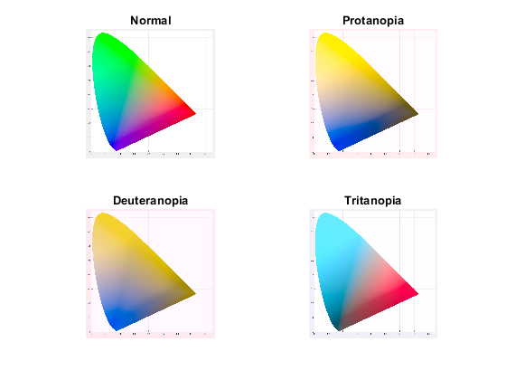
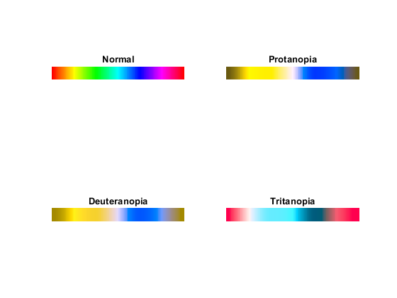
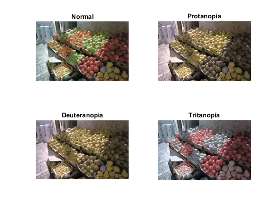

# Toolbox-for-color-vision-deficiency-simulation-and-color-space-conversion
MATLAB GUI and functions that can perform conversion between color spaces such as XYZ, Luv, Lab, sRGB, AdobeRGB, and simulate vision for three types of color vision deficiency (Protanopia, Deuteranopia, and Tritanopia)

Algorithm for color vision deficiency: Brettel's model.

Reference: H. Brettel, F. Vienot, and J. D. Mollon. Computerized simulation of color ´ appearance for dichromats. J. Opt. Soc. Am., 14(10):2647–2655, 1997.

Algorithm for cone response computation: Optimization based on CIE color matching function.

Reference: A. Stockman, D. I. A. MacLeod, and N. E. Johnson, ‘‘Spectral sensitivities of the human cones,’’ J. Opt. Soc. Am. A 10, 2491–2521 (1993).

This is my course project of OPTI588 at College of Optical Science, University of Arizona. The algorithm for color space conversion is from the lecture note.

